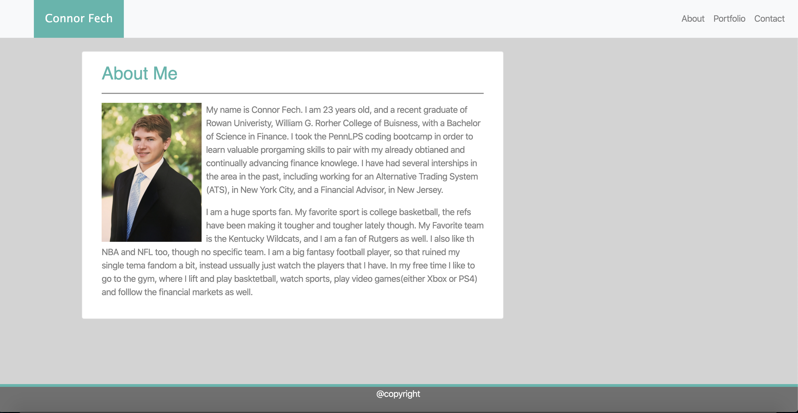
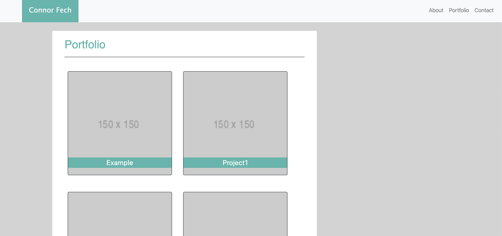
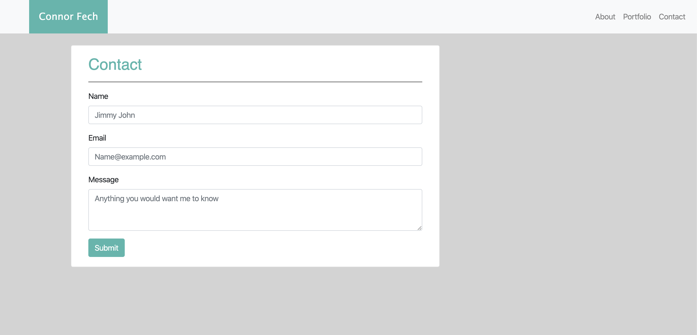

# cfech.github.io
In this project I created an about me page https://cfech.github.io/index.html, consisting of a summary about myself and links to my portfolio and a contact form.
In order to complete this I used a combination of HTML5, CSS3 and Bootstrap. I took some basic peices of a website, such as a navbar, forms, and cards, and added my own styling as well to make the webapages look as close to the specifications as I could get them. 

