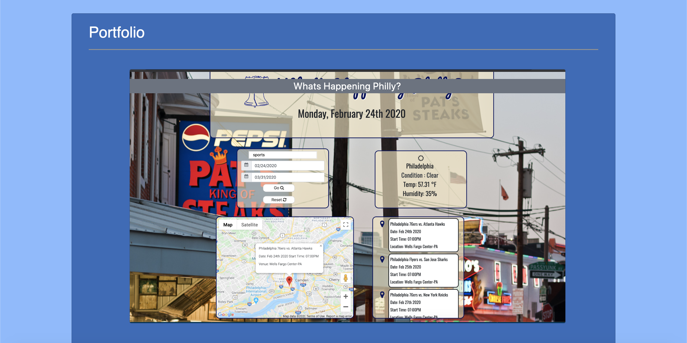
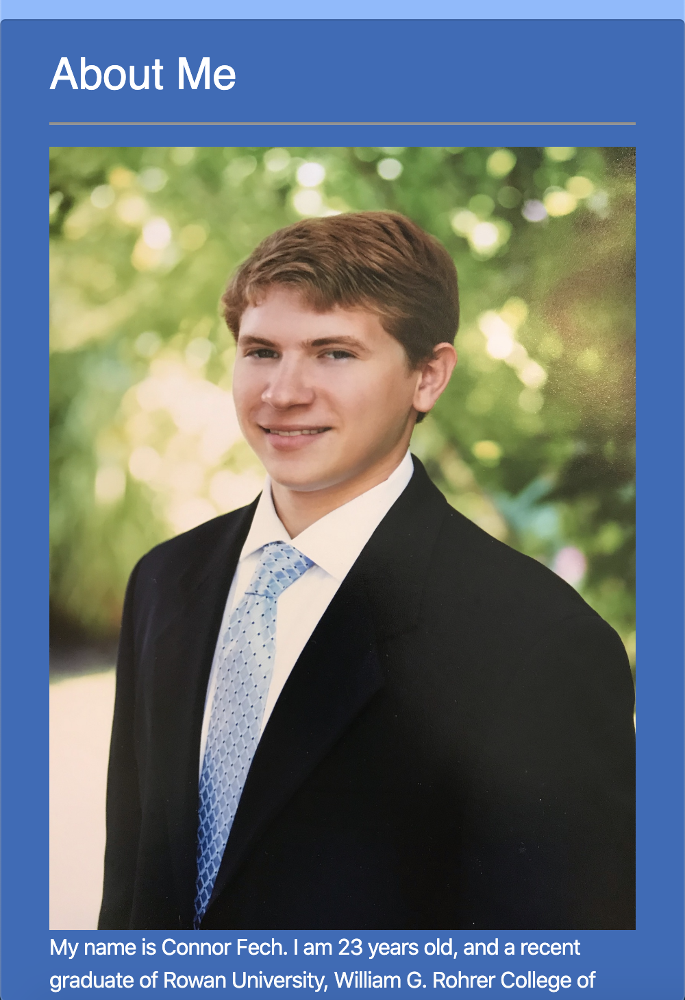
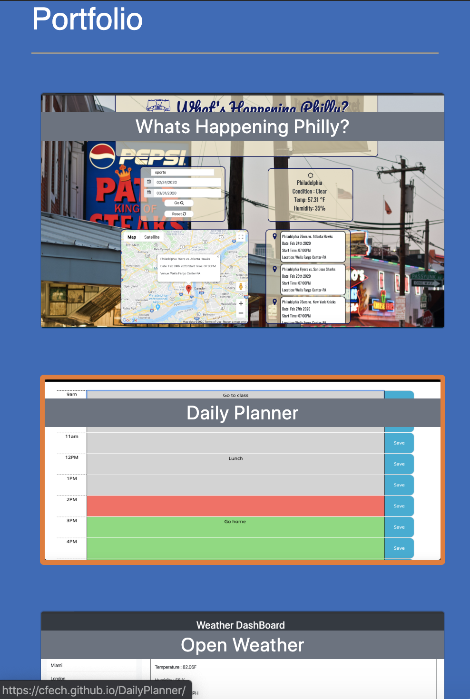
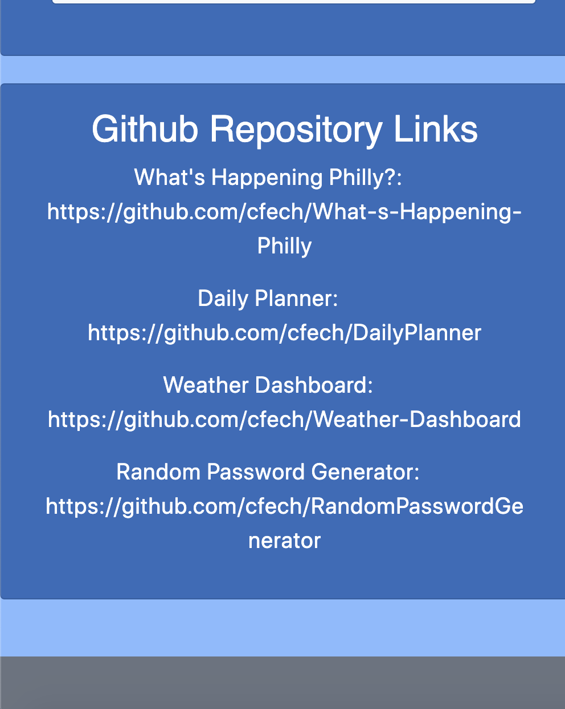

## Portfolio
This is my current portfolio. I used a combination of HTML CSS and Bootstrap 4 to make a fully responsive web page. It includes an about me section and picture, some links to my github page, current resume and linkedInn, as well as a portfolio section where my previous projects are displayed. I have also included the links to the github repositories as well. 
https://cfech.github.io/

